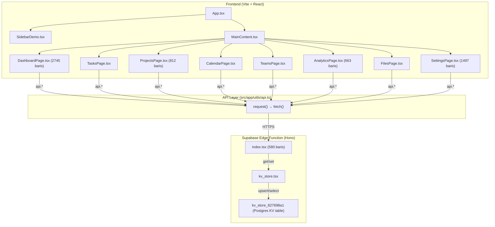

# 🔍 Audit Lengkap — Data Dummy & Integrasi Supabase

> **Tanggal:** 10 Juni 2026  
> **Proyek:** Minimalist Sidebar Component (Project Management Dashboard)

---

## 📐 Arsitektur Saat Ini



> [!IMPORTANT]
> Backend menggunakan **KV Store pattern** (satu tabel `kv_store_827698a1` dengan kolom `key TEXT, value JSONB`). Semua data disimpan sebagai JSON blob per key. **Bukan** tabel relasional terpisah.

---

## ✅ Fitur Yang Sudah Aktif & Terhubung ke Supabase

| Halaman | Fitur | Status Koneksi | Catatan |
|---------|-------|:-:|---------|
| **Tasks** | GET / POST / PUT / DELETE | ✅ Aktif | CRUD lengkap via `api.ts` → Edge Function |
| **Projects** | GET / POST / PUT / DELETE | ✅ Aktif | Grid view terhubung ke `api.getProjects()` |
| **Teams** | GET / Invite / Remove | ✅ Aktif | `api.getTeams()`, `api.inviteMember()` |
| **Calendar** | GET / POST events | ✅ Aktif | `api.getCalendarEvents()`, `api.createCalendarEvent()` |
| **Files** | GET / POST / PUT / DELETE | ✅ Aktif | CRUD lengkap termasuk folder |
| **Settings** | GET / PUT per section | ✅ Aktif | 10 sections: profile, workspace, notifications, appearance, timezone, members, billing, api-keys, webhooks, audit-log |
| **Dashboard** | Overview stats | ✅ Aktif | KPI cards menggunakan `api.getTasks()`, `api.getTeams()`, `api.getCalendarEvents()` |

---

## 🔴 DATA DUMMY YANG MASIH HARDCODED

### 1. `DashboardPage.tsx` — **KRITIS (2745 baris)**

Ini file terbesar. Main component (`DashboardPage`) sudah terhubung ke Supabase, **TETAPI** hampir semua sub-view menggunakan data hardcoded:

| Baris | Variabel | Deskripsi | Severity |
|-------|----------|-----------|:--------:|
| 379-388 | `weeklyData` | Data task mingguan (W1-W8) | 🔴 High |
| 390-395 | `teamData` | Data task per tim (Dev/Design/QA/PM) | 🔴 High |
| 397-403 | `initialRecentTasks` | Fallback task terbaru | 🟡 Medium |
| 405-409 | `schedule` | Jadwal hari ini (3 item) | 🟡 Medium |
| 412-419 | `revenueData` | Revenue bulanan Jan-Jun | 🔴 High |
| 421-426 | `kpiData` | KPI dashboard (4 item) | 🔴 High |
| 428-434 | `strategicGoals` | Target strategis (5 item) | 🔴 High |
| 436-441 | `deptHighlights` | Highlight per departemen | 🔴 High |
| 444-450 | `projectTimeline` | Timeline proyek Gantt | 🔴 High |
| 452-457 | `resourceData` | Alokasi resource tim | 🔴 High |
| 459-466 | `capacityData` | Kapasitas utilization W1-W6 | 🔴 High |
| 469-475 | `budgetData` | Budget per kategori | 🔴 High |
| 477-484 | `cashFlowData` | Inflow/outflow bulanan | 🔴 High |
| 486-492 | `expenseBreakdown` | Breakdown expense (pie chart) | 🔴 High |
| 495-500+ | `dailyData` | Data harian (Mon-Fri) | 🔴 High |

**Total ~30+ variabel hardcoded** di DashboardPage yang digunakan oleh sub-views:
- `ExecutiveSummaryView` — sepenuhnya hardcoded
- `OperationsView` — sepenuhnya hardcoded
- `FinancialView` — sepenuhnya hardcoded
- `WeeklyReportView` — sepenuhnya hardcoded
- `MonthlyInsightsView` — sepenuhnya hardcoded
- `QuarterlyAnalysisView` — sepenuhnya hardcoded
- `PerformanceMetricsView` — sepenuhnya hardcoded
- `PredictiveAnalyticsView` — sepenuhnya hardcoded

> [!CAUTION]
> **Hanya `OverviewView` yang benar-benar terhubung ke data live dari Supabase.** Semua 8 sub-view lainnya (Executive, Operations, Financial, Weekly, Monthly, Quarterly, Performance, Predictive) **100% menggunakan data dummy**.

---

### 2. `AnalyticsPage.tsx` — **KRITIS (663 baris)**

| Baris | Variabel | Deskripsi | Severity |
|-------|----------|-----------|:--------:|
| 9-71 | `dataByPeriod` | 3 set data per periode (completion + productivity + metrics) | 🔴 High |
| 73-78 | `taskDistribution` | Distribusi task (fallback jika live gagal) | 🟡 Medium |
| 80-86 | `topPerformers` | Top 5 performers (fallback) | 🟡 Medium |
| 342 | Inline array | Efficiency scores (4 tim) | 🔴 High |
| 384-388 | Inline array | Task completion metrics (4 KPI) | 🔴 High |
| 418-423 | Inline array | Task status breakdown (4 row) | 🔴 High |
| 444-449 | Inline array | Time tracking metrics (4 KPI) | 🔴 High |
| 461-466 | Inline array | Hours by team (4 tim) | 🔴 High |
| 482-488 | Inline array | Time allocation (5 kategori) | 🔴 High |
| 505-509 | Inline array | Team efficiency KPIs (4 item) | 🔴 High |
| 521-526 | Inline array | Team efficiency scores (4 tim) | 🔴 High |
| 547-551 | Inline array | Sprint performance history (4 sprint) | 🔴 High |
| 568-572 | Inline array | Benchmark KPIs (4 item) | 🔴 High |
| 585-590 | Inline array | Team vs industry (5 metrik) | 🔴 High |
| 615-619 | Inline array | Quarterly benchmark history (4 Q) | 🔴 High |
| 640-647 | Inline array | Detailed metrics table (7 row) | 🔴 High |

> [!NOTE]
> `AnalyticsPage` **sudah mencoba** memuat data live dari tasks di `useEffect` (baris 139-170), namun ini hanya untuk KPI cards dan chart distribusi. **Semua sub-view lainnya** (`analytics-task-metrics`, `analytics-time-tracking`, `analytics-team-efficiency`, `analytics-benchmarks`, `key-metrics`) tetap 100% hardcoded.

---

### 3. `ProjectsPage.tsx` — **HIGH (812 baris)**

| Baris | Variabel | Deskripsi | Severity |
|-------|----------|-----------|:--------:|
| 48-57 | `webFrontendTasks` | 8 task frontend web | 🔴 High |
| 59-67 | `webApiTasks` | 7 task API | 🔴 High |
| 69-76 | `webQATasks` | 6 task QA | 🔴 High |
| 78-86 | `mobileDesignTasks` | 7 task mobile design | 🔴 High |
| 88-97 | `mobileNativeTasks` | 8 task mobile native | 🔴 High |
| 99-104 | `webMilestones` | 4 milestone web | 🔴 High |
| 106-111 | `mobileMilestones` | 4 milestone mobile | 🔴 High |

> [!WARNING]
> Halaman grid (list semua project) sudah terhubung ke `api.getProjects()`, **TETAPI** ketika user klik masuk ke detail project (web-application, mobile-app), semua data yang ditampilkan adalah **hardcoded static** — bukan dari Supabase.

---

### 4. `SettingsPage.tsx` — **MEDIUM (1497 baris)**

| Baris | Variabel | Deskripsi | Severity |
|-------|----------|-----------|:--------:|
| 83-92 | `integrationList` | 8 integrasi (GitHub, Slack, dll) | 🟡 Medium |
| 94-98 | `sessionList` | 3 active sessions | 🟡 Medium |
| 100-106 | `loginHistory` | 5 login history entries | 🟡 Medium |
| 108-120 | `memberRows` | 11 member rows (fallback) | 🟡 Medium |
| 122-125 | `pendingInvites` | 2 pending invites (fallback) | 🟡 Medium |
| 127-132 | `invoiceHistory` | 4 invoice history (fallback) | 🟡 Medium |
| 134-150 | `auditLogs` | 15 audit log entries (fallback) | 🟡 Medium |
| 152-155 | `initialApiKeys` | 2 API keys (fallback) | 🟡 Medium |
| 157-160 | `initialWebhooks` | 2 webhooks (fallback) | 🟡 Medium |
| 162-169 | `accentColors` | 6 theme accent colors | ⚪ Config |

> [!NOTE]
> SettingsPage sudah **paling baik** integrasinya. `useEffect` di baris 243-287 memuat data dari 7 endpoint settings. Data hardcoded di sini berfungsi sebagai **initial state / fallback** — bukan primary source. Namun beberapa seperti `sessionList`, `loginHistory`, dan `integrationList` **tidak pernah dimuat dari server**.

---

### 5. `CalendarPage.tsx` — **LOW (466 baris)**

| Baris | Variabel | Deskripsi | Severity |
|-------|----------|-----------|:--------:|
| 35-39 | `monthMeta` | Metadata kalender (3 bulan) | 🟡 Medium |
| 43-46 | `weekDays` | Label hari (Mon-Sun + tanggal) | ⚪ Config |
| 48 | `timeSlots` | Slot waktu 8AM-6PM | ⚪ Config |
| 70-74 | `eventSubIdMap` | Mapping sidebar → event title | ⚪ Config |

> CalendarPage sudah terhubung baik ke Supabase. `monthMeta` adalah config navigasi, bukan data bisnis.

---

### 6. `SidebarDemo.tsx` — **MEDIUM**

Seluruh struktur navigasi sidebar **100% hardcoded** di dalam fungsi `getSidebarContent()`. Menu items, icon mapping, dan sub-navigation semuanya statis. Ini bukan masalah kritis karena navigation structure biasanya memang di-hardcode, tapi jika dibutuhkan role-based menu, ini harus dinamis.

---

## 🟡 Fitur Yang Belum Aktif / Tidak Terhubung

| Fitur | Lokasi | Status | Penjelasan |
|-------|--------|:------:|------------|
| **Authentication** | Tidak ada | ❌ | Tidak ada login/register — semua akses terbuka |
| **Share Calendar** | `CalendarPage.tsx:78-116` | 🔶 UI Only | Tombol "Send invite" tidak mengirim apa-apa |
| **Export PDF** | `AnalyticsPage.tsx:182-184` | 🔶 Toast Only | Hanya menampilkan toast, tidak menghasilkan file |
| **Download File** | `FilesPage.tsx:48` | 🔶 Toast Only | Hanya menampilkan toast |
| **Share File** | `FilesPage.tsx:50` | 🔶 Toast Only | "Share link copied" tapi tidak ada clipboard write |
| **Integration Toggle** | `SettingsPage.tsx:293-302` | 🔶 Local Only | Toggle state hanya di React state, tidak disimpan ke server |
| **Session Revoke** | `SettingsPage.tsx:644` | 🔶 Toast Only | Hanya toast, tidak ada API call |
| **Change Password** | `SettingsPage.tsx:312-318` | 🔶 Toast Only | Validasi lokal + toast, tidak ada backend |
| **2FA Setup** | `SettingsPage.tsx:320-325` | 🔶 Toast Only | QR code dummy, verifikasi hanya lokal |
| **Avatar Upload** | `SettingsPage.tsx:304-310` | 🔶 Local Only | File dibaca lokal, tidak di-upload ke storage |
| **Danger Zone** | `SettingsPage.tsx` | 🔶 Partial | Delete workspace hanya `api.resetWorkspaceData()` (KV cleanup) |
| **Billing** | `SettingsPage.tsx` | 🔶 Display Only | Data billing dari server tapi payment tidak aktif |
| **Workspace Logo** | `SettingsPage.tsx:746` | 🔶 Toast Only | "Logo upload coming soon" |
| **Dashboard sub-views** | 8 sub-views | ❌ | Executive, Operations, Financial, dll semuanya hardcoded |
| **Project detail views** | 5 sub-views | ❌ | Frontend, API, QA, Design, Native semuanya hardcoded |

---

## 📊 Ringkasan Kuantitatif

| Metrik | Jumlah |
|--------|:------:|
| Total file komponen | 10 pages + 12 modals + 1 sidebar |
| Total baris kode komponen | ~7,500+ baris |
| Variabel hardcoded ditemukan | **75+** |
| Endpoint API yang aktif | 22 endpoints |
| Sub-view dengan data 100% dummy | **13** |
| Fitur UI-only (toast/tidak terhubung) | **11** |

### Distribusi Konektivitas

```
Tasks Page      ████████████████████ 100% Connected
Calendar Page   ████████████████████ 100% Connected
Teams Page      ████████████████████ 100% Connected
Files Page      ████████████████████ 100% Connected
Settings Page   ████████████████░░░░  80% Connected (sessions, login history, integrations offline)
Projects Page   ████████░░░░░░░░░░░░  40% Connected (grid yes, detail views no)
Dashboard Page  ████░░░░░░░░░░░░░░░░  20% Connected (overview only)
Analytics Page  ████░░░░░░░░░░░░░░░░  20% Connected (KPI cards only)
```

---

## 🔧 Rekomendasi Prioritas Perbaikan

### Prioritas 1: Dashboard Sub-Views (Impact Tertinggi)
- Buat endpoint baru `/dashboard/executive`, `/dashboard/operations`, `/dashboard/financial`, dll.
- Atau: hitung semua metrik secara derive dari data tasks/projects/teams yang sudah ada di Supabase

### Prioritas 2: Project Detail Views
- Ubah task lists di project detail agar memfilter dari `api.getTasks()` berdasarkan project name
- Buat endpoint milestones atau simpan milestones sebagai bagian dari project data

### Prioritas 3: Analytics Sub-Views
- Semua chart data (time tracking, team efficiency, benchmarks) perlu endpoint atau perhitungan dari data live

### Prioritas 4: Settings Offline Features
- `sessionList` dan `loginHistory` perlu endpoint real (terkait auth)
- `integrationList` toggle perlu persist ke server

### Prioritas 5: Authentication System
- Implementasikan Supabase Auth
- Tambahkan RLS di database
- Role-based sidebar navigation

---

> [!TIP]
> **Pendekatan paling efisien:** Karena backend menggunakan KV Store, banyak data "reporting" (executive, financial, operations) bisa **dihitung secara client-side** dari data Tasks, Projects, dan Teams yang sudah ada — tanpa perlu endpoint baru. Ini mengurangi beban backend dan tetap eliminasi data dummy.
